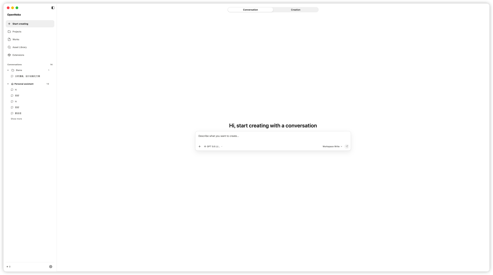
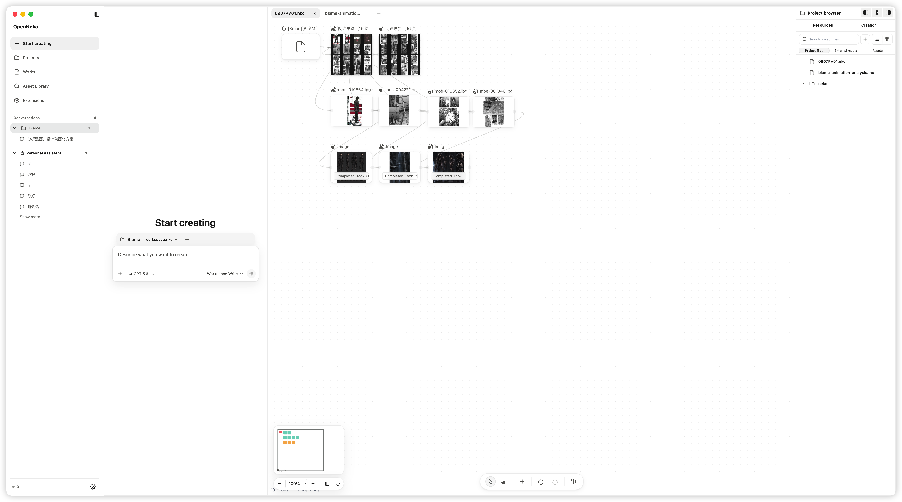

# OpenNeko

> 从对话到作品的本地优先 AI 创作工作台

[English](./README.md)


[](./LICENSE)

OpenNeko 是一款 Agent 驱动的桌面创作应用，将对话、项目文件、素材与画布放在同一个工作区。
你可以与 Agent 讨论想法、分析参考资料、生成内容，再在画布、文档编辑器和视频时间线中继续创作。



_从“开始创作”进入对话或创作模式，选择模型并描述你的创作需求。_

## 你可以做什么

| 能力       | 用途                                                      |
| ---------- | --------------------------------------------------------- |
| 对话与创作 | 从日常对话开始，或选择项目，让 Agent 围绕项目内容开展创作 |
| 项目与作品 | 组织本地项目文件，在项目浏览器中查找和打开创作内容        |
| 创作 Agent | 分析资料、规划任务、调用工具，并通过配置的模型生成内容    |
| 素材与画布 | 将参考图片、文档和生成结果放在画布中，建立连接并预览内容  |
| 文档与媒体 | 编辑文本，预览常用文档、图片、音视频和受支持的 3D 模型    |
| 视频时间线 | 编排、预览并导出轻量音视频项目                            |
| 模型与扩展 | 配置云端或本地 AI 服务，管理个人 Skill 和 OpenNeko 扩展   |

项目文件保留在本地。AI 对话、生成与理解能力取决于你配置的服务、模型权限和网络条件；使用云端模型时，相关输入会发送给所选服务。

<details>
<summary>查看创作工作区详情：Agent、画布与项目浏览器</summary>



围绕同一个项目，将 Agent 对话、参考素材、生成结果与创作文档连接起来。

</details>

## 当前状态

- **Alpha**：目前以源码体验和产品验证为主，界面与项目格式仍可能变化。
- **平台**：当前只支持 Apple Silicon macOS；发布的 DMG 尚未进行 Developer ID 签名和 Apple 公证。
- **产品重点**：Agent、项目、内容、素材与媒体创作。角色（Chara）和世界（World）目前仅在开发版提供实验入口，尚不提供完整的角色助手创作与世界体验。
- **开发中**：完整端到端创作闭环、稳定发布通道和专业工具集成尚未完成。

## 从源码开始

需要 Apple Silicon macOS、Node.js 24.18.0 LTS 和 pnpm 10.29.2。

```bash
corepack enable
pnpm install
pnpm build
pnpm dev:desktop
```

启动后，在左下角设置中配置 AI 服务和模型，再从“开始创作”发起对话，或选择项目进入创作。
模型配置保存在 `~/.neko/config.toml`。详细开发与验证说明见[参与开发](./CONTRIBUTING_CN.md)。

## 了解更多

- [文档导航](./docs/README.md)
- [Desktop 开发路线图](./ROADMAP_CN.md)
- [参与开发](./CONTRIBUTING_CN.md)
- [系统架构](./docs/architecture/README.md)

欢迎提交真实创作场景、可复现问题、Skill、模型接入、创作能力、测试和文档改进。

## License

OpenNeko 使用 MIT 许可证，详见 [LICENSE](./LICENSE)。
