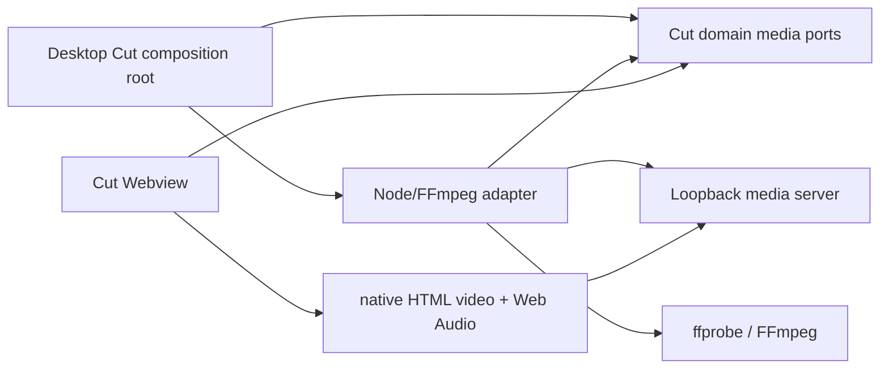

# Design: Node/FFmpeg Cut media runtime

## Five-layer analysis

### 1. Responsibilities

- Domain ports describe Cut media operations without naming Node, FFmpeg,
  Electron, WebSocket, or Engine DTOs.
- Desktop Main owns trusted workspace path resolution, ffprobe/FFmpeg
  processes, cache/session lifecycle, cancellation, and loopback HTTP delivery.
- Chromium owns Range scheduling, demux, buffering, and decode. The Webview
  owns `<video>` lifecycle, Web Audio playback, and recoverable presentation
  state.
- OpenNeko owns the preview clock and maps media timestamps to OTIO timeline
  time.
- OTIO remains the project/edit model; FFmpeg is an execution adapter, not a
  second project model.

### 2. Dependencies

The renderer Webview never receives local file paths and never calls Node or
Electron Main APIs. Media bytes do not cross typed IPC.

### 3. Interfaces

The frozen contract exposes:

- `MediaProbePort.probe`
- `FrameCapturePort.captureFrame`
- `AudioWaveformPort.renderWaveform`
- `VideoPreviewPort.startPreview/resumePreview/stopPreview`
- `AudioPcmStreamPort.startPcm/resumePcm/stopPcm`
- `ExportJobPort.export`

Preview results use an explicit native video descriptor:

- MIME type
- one opaque loopback Range URL
- session identity and prepared media time origin

PCM results use an explicit HTTP descriptor:

- protocol version
- stream URL
- sample rate and channel count
- session identity

Every session-scoped operation carries its session identity. Unknown, stale, or
mismatched sessions fail visibly.

### 4. Extension points

- The domain ports remain the only adapter replacement point.
- Codec/container policy is a focused preparation strategy inside the
  Node/FFmpeg adapter; the composition root selects exactly one adapter.
- Future native 10-bit/HDR preview can add a new declared preparation profile
  without changing OTIO or reintroducing Engine fallback.
- FFmpeg executable discovery is injected so development, packaged, and test
  runtimes can use different resolved binaries without changing media logic.

### 5. Testing

- Contract tests cover path containment, probe projection, command construction,
  native video descriptors, PCM framing, cancellation, cleanup, and export
  validation.
- Webview tests cover native source assignment, muted video, PCM clock selection,
  timeline mapping, drift handling, and disposal.
- Path assertions prove the Node adapter is selected and the poisoned Engine Cut
  path is never invoked.
- Isolated Electron Desktop validation covers a synthetic H.264 fixture, PCM
  audio, seek/resume, frame/waveform operations, and an unsupported input that
  follows the explicit preparation path.
- Repository audit checks all remaining Engine imports, commands, routes, DTOs,
  package dependencies, build scripts, and documentation.

## Canonical runtime flow

1. Cut resolves an OTIO media reference through Desktop Main.
2. The adapter probes the source and selects one declared preparation profile.
3. The Host registers the compatible source or completes a prepared file.
4. The loopback server exposes one opaque Range URL per video session.
5. The Webview assigns that URL directly to a muted `<video>`.
6. FFmpeg decodes each audible input to framed PCM over loopback HTTP.
7. OpenNeko selects the primary PCM clock when available, otherwise the video
   clock, then maps it to OTIO time.
8. Stop/cancel tears down processes, responses, media sources, audio nodes, and
   temporary artifacts.

There is no legacy Engine retry or automatic adapter fallback at any step.

## Preview preparation profiles

| Source                                    | Initial preview action                                   |
| ----------------------------------------- | -------------------------------------------------------- |
| H.264 compatible MP4                      | authorize the original file as a native Range resource   |
| H.264 incompatible container              | remux into fragmented MP4                                |
| VP8 WebM after real Webview qualification | authorize the original file as a native Range resource   |
| VP8 before qualification                  | explicitly transcode to H.264 SDR preview                |
| HEVC, AV1, other video                    | explicitly transcode to H.264 SDR preview                |
| 10-bit/HDR requiring H.264 proxy          | tone-map and convert to the declared SDR preview profile |
| Any audible audio                         | decode to interleaved float32 PCM                        |

Preparation choice and failure are diagnostic events. Transcoding is not
reported as direct playback.

## Synchronization

The `<video>` element is always muted. Audio embedded in a video asset follows
the same PCM path as standalone audio tracks.

The preview clock stores:

- OTIO timeline origin
- media origin
- playback rate
- active interval
- selected clock source

PCM is authoritative once its playback clock is ready. Video is authoritative
for video-only intervals. Small drift is corrected by video playback-rate
nudging; discontinuities trigger an explicit seek/reprepare instead of silently
letting tracks diverge.

## Process and resource lifecycle

- Each preview/export operation owns its children, abort signal, outputs, and
  session registry entry.
- FFmpeg stderr is captured into bounded diagnostics.
- A stopped or replaced preview cannot continue serving bytes.
- Loopback URLs are unguessable, session-scoped, and never expose filesystem
  paths.
- Cache writes use staging plus atomic publication; incomplete artifacts are not
  reusable.
- Desktop runtime disposal terminates children, closes the server, and removes
  session-owned temporary data.

## Composition switch and legacy removal

The switch is a single composition-root edit. Before switching, the Node adapter
must pass focused tests. After switching:

1. The old Cut Engine factory/constructor is poisoned so any invocation throws a
   deterministic diagnostic.
2. Path tests prove the composition root never reaches it.
3. Cut-specific Engine adapter, connection, routes, client methods, DTOs, tests,
   and dependencies are deleted.
4. No compatibility adapter or feature fallback remains.

## Engine deletion gate

`packages/neko-engine` is deleted only when a repository-wide dependency closure
finds zero remaining owned responsibilities. The audit must include:

- runtime imports and Desktop activation
- commands and configuration
- protobuf services/messages and generated DTO consumers
- HTTP/WebSocket routes and clients
- packaging/native artifacts and CI scripts
- tests, fixtures, docs, and release workflows
- consumers in Preview, Canvas, Assets, Tools, Agent, Desktop composition and packaging

If any consumer remains, this change records its owner and keeps the Engine.
Partial Cut decoupling must not be presented as whole-Engine removal.

## Key risks

- Packaged FFmpeg binaries and codec licensing remain a release/distribution
  concern and must be verified separately from development PATH discovery.
- Full-source proxy creation can delay first frame; preparation should remain
  interval-oriented and cacheable.
- Current Electron WebM behavior must be measured, not inferred from a
  generic Chromium capability table.
- SDR proxy preview does not validate native HDR output correctness.
