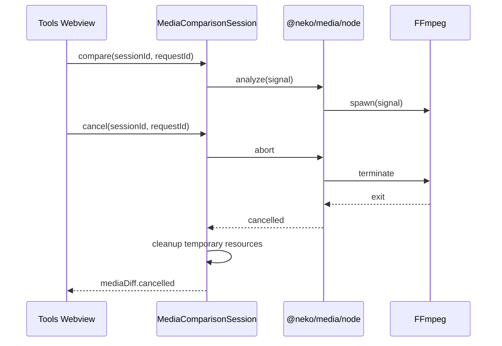

## Context

当前实现把两个不同职责放在同一条历史链上：

```text
diff.proto
  -> @neko/shared generated Engine* interface
  -> Neko Tools analyzer/runtime
  -> mediaDiffProtocol
  -> Tools Webview

timeline.proto / shared ProjectData
  -> NKV codec + JVI workspace model
  -> Tools Timeline Diff
  -> Cut/Agent legacy projection
```

第一条链没有 Protobuf encode/decode、版本协商、跨语言进程或网络 transport；第二条链已经与 Cut 的 OTIO-only canonical path 冲突。保留二者会把普通 TypeScript shape 伪装为 wire contract，并使旧 NKV 功能继续从 manifest、bootstrap、index 和 viewer 返回成功。

本设计只保留真实产品边界：本地媒体分析、Extension/Webview 沙箱消息、OTIO/NKC owning domain contract 和 `@neko/media` 的低层媒体进程能力。

## Goals / Non-Goals

**Goals:**

- 保留图片、音频、视频比较和 Git revision comparison。
- 建立唯一、窄、host-neutral 的 Tools media comparison contract。
- 删除 NKV/JVI/Timeline Diff 和伪 Proto/Engine projection 的完整调用链。
- 使指标、取消、超时、资源释放和 UI 展示声明与真实行为一致。
- 证明 Cut、Agent、Canvas、TUI 不再通过旧 Timeline/NKV fallback 成功。

**Non-Goals:**

- 建设通用 diff framework、动态 analyzer 插件系统或跨产品 comparison SDK。
- 把 Tools 领域 result 下沉到 `@neko/media` 或 `@neko/shared`。
- 增加新的图像 heatmap 文件、媒体编辑或 Timeline authoring。
- 清理全部 `@neko/shared` orphan surface。

## Five-Layer Analysis

### 1. Responsibilities

| Owner                          | Responsibility                                                                                  | Explicitly does not own                            |
| ------------------------------ | ----------------------------------------------------------------------------------------------- | -------------------------------------------------- |
| `@neko-tools/contracts`        | Media comparison request/result/message、schema、diagnostic、session identity、运行时 validator | VS Code、React、Node process、文件 IO、FFmpeg 参数 |
| Tools Extension                | URI/权限解析、Git revision materialization、比较 session 生命周期、调用媒体 port、Webview 编排  | 浏览器渲染、持久 project model、Timeline authoring |
| Tools Webview                  | 展示已验证结果和本地可恢复的 layout/display mode                                                | 文件访问、FFmpeg、持久事实、隐式 active session    |
| `@neko/media`                  | probe/frame/waveform/音视频 process 与可取消 Node adapter                                       | Tools result、VS Code message、Timeline DTO        |
| Cut/Canvas/Agent owning domain | OTIO/NKC projection、稳定 identity、领域 intent                                                 | NKV fallback、共享 writable Timeline               |

### 2. Dependencies

目标依赖方向：

```text
@neko-tools/contracts (L0)
        ↑                 ↑
Tools Extension      Tools Webview
        ↓
@neko/media host-neutral port
        ↓
@neko/media/node -> FFmpeg

Cut -> @neko-cut/domain (OTIO)
Canvas/TUI -> NKC-owned contract
Agent -> explicit read-only context payload
```

- `@neko-tools/contracts` 零依赖，不反向引用 Extension/Webview。
- Extension 可以依赖 `@neko/media`，Webview 不得依赖 Node/VS Code。
- `@neko/media` 不得依赖 Tools，也不接受 `EngineDiff*` 或 UI display mode。
- 功能包不得直接 import 另一个功能包的内部 Timeline 实现。
- 删除 Proto 后不得用新的 `generated`、`engine` 或 `compat` package 平移旧层级。

### 3. Interfaces

`@neko-tools/contracts` 使用判别联合表达唯一公共 contract。字段名为设计约束，最终实现可在不改变语义的前提下细化：

```ts
type MediaKind = 'image' | 'audio' | 'video';

interface MediaDiffRequest {
  schemaVersion: 1;
  sessionId: string;
  requestId: string;
  left: MediaResourceRef;
  right: MediaResourceRef;
  kind: MediaKind;
}

type MediaDiffResult = ImageDiffResult | AudioDiffResult | VideoDiffResult;

type MediaDiffMessage =
  | { type: 'mediaDiff.started'; sessionId: string; requestId: string }
  | { type: 'mediaDiff.completed'; sessionId: string; requestId: string; result: MediaDiffResult }
  | {
      type: 'mediaDiff.failed';
      sessionId: string;
      requestId: string;
      diagnostic: MediaDiffDiagnostic;
    }
  | { type: 'mediaDiff.cancelled'; sessionId: string; requestId: string };
```

约束：

- `MediaResourceRef` 只携带 Host 可解析的逻辑资源 identity；Webview message 不携带绝对本地路径、token、进程 handle 或临时文件。
- 所有 operation/event 显式携带 `sessionId + requestId`。缺失、陈旧或不匹配立即 diagnostic，不回退 active viewer。
- 所有 ratio 使用 `0..1`，所有 duration/time 使用命名单位；validator 拒绝 `NaN`、无穷、越界和未知 schema。
- result 只包含真实计算字段。当前实现无法生成的静态 heatmap URI、固定 `colorHistogramDiff = 0` 等字段删除。
- Webview 的 overlay、curtain、onion-skin 和 GPU transform 是 `DisplayMode`，只存在于 presentation state，不属于分析 result。
- `showMediaInfo` 调用 `@neko/media` probe，并把受控、可序列化 metadata 投影到 UI；probe 失败返回 diagnostic，不显示基于扩展名猜测的“成功”。

### 4. Extension

固定的 image/audio/video 策略不是运行时扩展点。一个 `MediaComparisonService` 按已验证 `kind` 直接分派到三个包内纯函数/模块；不保留 analyzer registry、provider factory 或跨包 plugin API。

未来只有在出现第二个真实实现、独立生命周期或外部扩展注册需求时，才能在新的 OpenSpec 中引入 strategy/registry。增加新媒体 kind 时同时更新判别联合、validator、Extension handler、Webview renderer 和路径测试，未知 kind fail-visible。

### 5. Testing

- contract tests 验证每个 message/result variant、schema version、ratio 边界、未知字段策略和 stale identity。
- service tests 断言 image/audio/video canonical analyzer 与 `@neko/media` adapter 被命中，legacy Timeline analyzer 和 `EngineDiff*` path 被 poison。
- cancellation tests 使用真实或可控子进程，证明 abort/timeout 会终止 FFmpeg、等待 exit、再删除临时资源，并只结束目标 request。
- Extension/Webview tests 验证完成、失败、取消、陈旧消息、viewer dispose 与并行 session 隔离。
- manifest/bootstrap tests 证明 `.nkv` language/custom editor、JVI/LSP/index/Timeline Diff command 不再注册。
- producer/consumer typecheck、build 和 dependency gates 证明 Proto/shared Timeline export 不再被引用。
- VS Code Extension Development Host 使用隔离媒体 fixture 验证 compare、cancel、Media Info 与 viewer disposal；不得使用用户工作区。

## Decisions

### 1. Keep media diff, delete Timeline diff

图片、音频、视频比较依赖本地媒体文件和 FFmpeg，有独立用户入口与运行边界，应保留。Timeline Diff 只理解已退休的 NKV/JVI project model，并与 OTIO Cut 的领域语义重复，必须连同注册、索引、viewer 和 tests 垂直删除。

不将 Timeline Diff 改造成 OTIO Diff：当前没有已确认的产品需求、稳定 OTIO comparison semantics 或第二个 caller。若未来需要，应由 Cut owning domain 定义 revision-aware OTIO diff，而不是恢复 Tools 的共享 writable Timeline。

### 2. Own the contract in Neko Tools

Extension 与 Webview 是两个真实 runtime consumer，因此建立单独 L0 `@neko-tools/contracts`。把 contract 留在 Extension 会迫使 Webview 反向依赖 Host；放入 `@neko/shared` 会扩大公共面；放入 `@neko/media` 会混淆低层媒体操作和产品分析结果。

`@neko-tools/contracts` 只包含类型、常量和 runtime validator，不包含 service、React、VS Code、Node 或 codec。

### 3. Delete Proto rather than rename generated types

`diff.proto` 和 `timeline.proto` 当前没有 serialization 或跨语言边界。将 `EngineDiff*` 重命名为 `MediaDiff*` 但继续生成，只会保留无 owner 的 indirection。调用方迁移后删除两个 IDL、生成物和 generator；若 package 为空，删除 package 与 CI gate。

未来真实 wire contract 可重新建立 Proto，但必须同时说明 producer、consumer、serialization、versioning、兼容策略和生成物 owner。普通 TS Host/Webview contract 使用 owning package schema。

### 4. Retire NKV as one fail-closed slice

删除顺序以防止 legacy path 继续成功：

1. 先建立 NKC-only、OTIO-only 和 Tools media-only 目标 contract/测试；
2. poison NKV/JVI/Timeline Diff 与旧 generated route；
3. 删除 manifest/bootstrap/index/viewer/analyzer/codec/export；
4. 迁移剩余 Cut/Agent/Canvas/TUI caller；
5. 删除 shared Timeline/NKV types、Proto/generator 和 compatibility tests；
6. 增加禁回流 gate。

旧 `.nkv` 文件保留在磁盘。OpenNeko 不自动转换，也不把解析失败解释为空项目或普通媒体 diff。

### 5. Make cancellation a resource-lifecycle contract

每个 compare request 创建独立 `AbortController`，并把同一 `AbortSignal` 传到 probe、frame extraction、SSIM/audio/video analysis 和所有 FFmpeg process。用户取消、viewer dispose、request supersede 和 timeout 都触发 abort。



timeout 不再通过孤立 `Promise.race` 提前返回；它 abort 同一 signal，等待进程退出并完成 cleanup。cleanup failure 记录 diagnostic，但不得把已失败或已取消请求改写为成功。

### 6. Prefer truthful contraction over placeholder output

- 图片差异的 `diffPixelRatio` 在 runtime 与 analyzer 间保持 `0..1`，不再次除以 100。
- 无真实计算来源的 result 字段直接删除；不以空 string、固定零或扩展名推断冒充成功。
- WebGL/video 的实时视觉变换可保留，但 UI 明确标为 display mode，不声称生成可持久 heatmap artifact。
- 未读取的全局设置删除；viewer display state 按实例保存为可恢复 UI state。

## Canonical Runtime Paths

### Compare

```text
VS Code command / Git comparison
  -> resolve two explicit resource refs
  -> create request-scoped session
  -> validate MediaDiffRequest
  -> MediaComparisonService direct kind dispatch
  -> @neko/media/node cancellable operation
  -> validate MediaDiffResult
  -> project package-owned Webview message
  -> renderer selected by result.kind
```

### Media Info

```text
explicit selected URI
  -> Host permission/path resolution
  -> @neko/media probe
  -> serializable metadata projection or diagnostic
  -> Webview/VS Code presentation
```

任何步骤失败都返回明确 diagnostic，不回退 Timeline analyzer、active editor、空 result、默认 metadata 或旧 Engine DTO。

## Risks / Trade-offs

- [Cut/Agent 仍隐式依赖旧 Timeline shape] → 先列出所有 production consumer，逐一迁移到 OTIO projection/explicit context，并用 poison export 与 package typecheck 证明旧 path 未参与。
- [删除 NKV codec 影响 Canvas/TUI] → 把 generic default registry 替换为 caller-owned NKC-only registry；测试显式断言 `.nkv` 被拒绝且文件未改写。
- [取消进程在不同平台行为不同] → `@neko/media/node` 统一 terminate/exit contract，覆盖正常退出、强制终止、timeout 和 dispose；记录仍存活 PID 视为测试失败。
- [删除 Proto gate 降低未来约束] → 用 architecture/legacy-debt gate 禁止无真实 wire owner 的 `*.proto -> TS interface only` 链；未来 Proto 通过独立 proposal 恢复。
- [一次 cleanup 跨包较大] → 按 vertical slice 分阶段提交，但在 change 完成前不允许 compatibility alias 或双路径返回成功。

## Migration Plan

1. 冻结 inventory：manifest、commands、messages、analyzers、generated exports、NKV codec、Cut/Agent/Canvas/TUI consumer、tests、docs 和 CI。
2. 建立 `@neko-tools/contracts` 及 contract/path tests，迁移保留的 media compare 与 Media Info。
3. 修复 ratio、truthful result、request-scoped cancellation/timeout/cleanup，并完成 Tools runtime 与 Webview tests。
4. poison 后删除 Tools JVI/LSP/index/Timeline Diff vertical slice 和无效配置。
5. 将 remaining consumer 迁移到 OTIO/NKC/explicit Agent context，删除 shared Timeline/NKV/Diff surface。
6. 删除 Proto IDL、生成物、generator、package、scripts 和 CI job，更新架构文档与禁回流 gate。
7. 完成全仓 producer/consumer、quality gate 和 Extension Development Host 验收。

## Rollback

代码回滚必须按整个 canonical slice 回滚，不能只恢复 generated aliases 或 NKV fallback。用户项目和媒体文件从未被迁移或改写，因此不需要数据回滚。若媒体比较新路径出现阻塞，允许回退到 change 前版本，但不得在新版本中同时启用新旧 contract。

## Open Questions

None.
