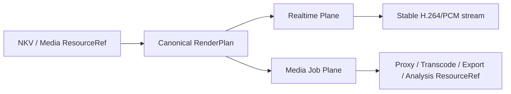
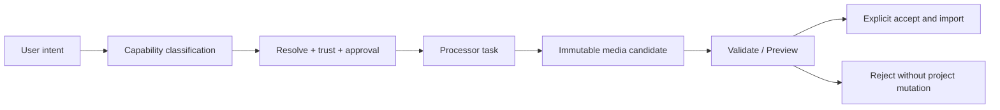

## Context

OpenNeko 当前的 Cut 与 Engine 同时承担播放、编辑、媒体生产、开放式特效和接近专业 NLE 的扩展语义。真正增加跨平台难度的不是 FFmpeg 或 GPU 解码本身，而是自定义 shader、动态 effect/plugin、复杂 blend/mask/keyframe、专业调色、平行 renderer 和宽泛 DTO 让每个平台都需要组合调试解码、显存互操作、合成、UI 与导出差异。

直接删除 `neko-engine` 并频繁启动 FFmpeg CLI 不能满足实时编辑：进程启动、硬件设备初始化、关键帧预热、管道重连和状态重建会使 seek、scrub 与编辑后预览产生可见卡顿。将视频改为 CPU 解码也会降低多层和高分辨率素材性能，并扩大“某平台悄悄成功、另一平台明显退化”的调试面。

AI 视频生成改变的是创意变换的实现位置，而不是时间线事实的必要性。生成式修复、风格化、背景替换、抠像/跟踪、补帧和高级合成可以输出新的扁平媒体；但精确剪切、同步、字幕、音频混合、项目可编辑性、实时预览和交付仍要求确定性 Engine。AI 结果还必须具有来源、模型和接受状态，不能被伪装成可重放的 NKV effect。

本变更跨越 NKV/OTIO、Proto、Rust Engine、Cut Extension/Webview、neko-client、Agent/External Processor、Assets/Canvas/Preview/Tools 与三平台分发。实现必须遵守 Rust 计算权威、Proto 单一 wire contract、Webview 沙箱、显式 document/session/job identity、ResourceRef、fail-visible 和预发布单一 canonical path。

## Goals / Non-Goals

**Goals:**

- 提供从素材导入、代理/转码、轻量时间线编辑、GPU 实时预览、DSP 混音到视频导出的完整闭环。
- 让 NKV 成为可验证、可迁移的 lightweight project profile，并与 OTIO 基础 editorial structure 稳定交换。
- 保留长驻 GPU-only FFmpeg/libav realtime runtime，支持 seek、scrub、逐帧、A/V 同步和 timeline revision 原子更新。
- 将 proxy、transcode、export、audio render、waveform 和 loudness 统一为有进度、取消、原子提交和 provenance 的受管任务。
- 通过闭合能力矩阵删除开放式专业剪辑面，并由 AI/专业处理器承接真正 profile-external 的工作。
- 让 AI 输出以不可变候选素材进入明确的 review/accept/import 流程，保护源素材与项目 revision。
- 垂直清理 Webview、Extension、Proto、Engine、Agent、文档和测试中的旧路径，避免隐藏 fallback 或双实现。

**Non-Goals:**

- 构建 Premiere、DaVinci 或 After Effects 级 NLE、调色、合成、动画或插件生态。
- 支持任意 WGSL、FFmpeg argv/filter graph、OpenFX、第三方 DSP、动态原生插件或无限 effect graph。
- 支持非 normal blend、mask、通用关键帧、速度曲线、倒放、复杂 transition、嵌套 composition 或无限视觉层。
- 提供 CPU 视频解码兼容模式、显式软件解码开关或硬件失败后的隐式 fallback。
- 将 OTIO 作为可写项目事实，或声称所有 OTIO adapter/metadata 都可以无损往返。
- 让 AI 直接编辑 NKV 内部结构、覆盖源素材、成为实时 renderer，或把非确定性输出保存为可重放 effect 参数。
- 由 Engine 发现、审批或执行外部 AI/provider；Engine 只消费和产生已授权媒体资源。

## Decisions

### 1. 产品能力按“确定性编辑”和“生成式处理”分层

OpenNeko 只有一个 Cut 模式，内建以下确定性能力：

- 素材 probe、代理、转码和派生分析；
- trim/split/reorder、受控多轨与三层视觉合成；
- 静态布局、标题/字幕、简单转场、固定正向倍速和基础调色；
- 多轨音频、纠正/交付型 DSP、实时预览、capture 和 export；
- NKV 持久化、OTIO 交换、undo/redo、relink 和 revision 管理。

AI/专业处理器承接生成式或专业视觉任务：背景替换/扩展、复杂抠像与跟踪、超分、补帧、去噪、风格化、高级 grade、复杂 transition/composition 和生成新镜头。分类依据是可复现的项目语义和轻剪辑闭环，而不是已有代码是否方便保留。

替代方案“把所有视频处理交给 AI/外部工具”会破坏离线可用性、精确时间控制、可编辑性和稳定导出；替代方案“继续内建高级能力”则保留当前最大维护面，因此均不采用。

### 2. NKV v3 lightweight profile 是唯一可写项目事实

目标模型如下：

```text
LightweightNkvProject
  project: resolution, fps, duration, color baseline, lineage
  ordered visual tracks: video | title | subtitle
    maximum active visual elements at any time: 3
    clip: sourceRef, timeline range, source range
          static transform/crop/fit/opacity, normal blend
          optional basic color, constant positive rate
  audio tracks and embedded audio
    clip: sourceRef, timeline/source range, mute/gain/pan/fades
          closed corrective DSP chain
  transitions: cut | fade | cross-dissolve
  workflow lineage: non-render metadata
```

轨道数量用于组织，不等于解码并发；validator 按区间计算最多三个活跃视觉元素。Painter order 从下到上，只有 normal source-over alpha。上层 gap 透明，所有视觉层为空时输出项目黑场。每条视频轨内部 clip 不重叠，跨轨重叠用于受控 overlay/PIP/title/subtitle。

基础调色第一版固定为 exposure/brightness、contrast、temperature/tint 和 saturation；文字只支持确定性字体 fallback、静态布局和有界样式；音频节点是版本化 closed union。未知字段和超限语义在保存或资源分配前拒绝，不能塞入 generic metadata/effect JSON。

三层而不是单层是为了覆盖 B-roll、屏幕录制加摄像头、Logo、标题和字幕；限制三层而不是无限层是为了固定 decoder、显存、合成和测试预算。

### 3. OTIO 是交换映射，不是 NKV 的基类

NKV 与 OTIO 的 `Timeline/Stack/Track/Clip/Gap/Transition` 进行双向映射。OTIO track order 映射为 NKV painter order；clip range、gap、cut、fade/cross-dissolve 进入标准结构；静态布局、基础调色、文字样式和 DSP 使用版本化 `openneko.*` namespaced metadata。

Import 必须先做 capability inspection。嵌套 Stack、timewarp、未知 required metadata、超出三层、复杂 effect/transition 等不可表示对象返回 object/path-level diagnostic，并保持源 OTIO 不变。用户可以显式调用外部处理器 flatten 为新媒体后重新导入，但 adapter 不自动 flatten。

不按 OTIO 直接扩展 Engine model，是因为 OTIO 的目标是 editorial interchange，不拥有 OpenNeko 的实时渲染、代理、DSP、资源授权和项目迁移语义。

### 4. `neko-engine` 保留为双平面的长驻运行时



Realtime Plane 嵌入 FFmpeg/libav，session 独立拥有 decoder、GPU surfaces、clock、mixer、transport、queue、generation 和 cancellation。Seek 在现有 decoder context 中 seek/flush/pre-roll；timeline update 使用 `streamId + expectedRevision + nextRevision` 后台准备并原子切换 RenderPlan，公共 stream/WebSocket identity 不变。

Media Job Plane 统一管理 `proxy | transcode | timeline-export | audio-render | waveform | loudness`。内部可以使用受管 FFmpeg 子进程或 library worker，但只能消费 Engine 生成的 typed plan/profile；公共 API 不接受 shell、argv 或 filter graph。

保留 Engine 而不是直接调用 FFmpeg CLI，是为了拥有长驻实时状态、跨任务 QoS、ResourceRef 授权、统一错误语义、preview/export parity 和可靠 shutdown，而不是重新实现 FFmpeg codec/filter 能力。

### 5. 所有视频输入严格 GPU-only

macOS、Windows、Linux 分别使用打包并验证的 VideoToolbox、D3D11VA 和 VA-API 类 FFmpeg profile。启动 self-check 必须真实解码合成/打包 fixture，验证 codec、pixel format、frame output 和必要互操作；列出 `hwaccels` 不算成功。

Realtime、capture、proxy、transcode 和 export 的视频输入都必须命中声明的硬件 decoder。设备、driver、codec、surface 或 pixel format 不满足时 stream/job 失败并返回 backend diagnostic；不存在 CPU decoder 配置、兼容模式或静默 fallback。

编码策略独立于解码策略。Preview/proxy/export 可以各自使用显式版本化 encoder profile；若允许 software encoder，它也不能被描述或实现为 CPU decode fallback。

GPU decode 不代表一律零拷贝。仅保留 normal-alpha、硬件 frame import、必要 upload/download、encoder bridge 和平台句柄；custom effect/mask/LUT 专用互操作在路径测试证明无保留消费者后删除。

### 6. Preview、capture 和 export 共用 Canonical RenderPlan

Host-neutral NKV/OTIO domain codec 产生 Canonical BasicTimeline；Rust validator 将其编译为版本化 RenderPlan，包含 source/time mapping、layer order、layout、transition、color、text、audio/DSP 和 output descriptor。Realtime renderer、capture 和 timeline export 只能消费该计划。

实时和离线可以采用不同调度或 encoder，但必须用 golden frame、text layout、transition boundary、sample-accurate audio、duration 和 color tolerance 证明语义一致。TypeScript/Webview 不维护第二套时间线解释，FFmpeg job 也不能自行解析 NKV effect JSON。

### 7. 生产型媒体任务属于 Engine，不属于 AI/专业处理器

Proxy 以 source content hash、profile revision 和 Engine/FFmpeg runtime revision 为 key，产出可重建 ResourceRef 与 source-time mapping；NKV 始终引用原素材。Transcode 产出新 Asset/ResourceRef，不隐式替换 source。Waveform/loudness 是可重建派生物，不增加项目 revision。

Timeline export 冻结 `documentUri + projectRevision + snapshot + authorized ResourceRefs + output profile`，先写 Host 分配临时位置，验证 codec/duration/size 后原子提交。取消或失败清理临时文件，不覆盖已有目标。

QoS 固定为：

```text
realtime playback > seek/capture > proxy > transcode/export/audio-render
```

Job manager 使用 bounded concurrency 和 GPU session budget；资源不足时后台任务排队/节流，不抢占实时 session，也不回退 CPU decode。

### 8. 音频保留纠正与交付型 DSP

保留 decode、resample、channel conversion、gain/volume/pan、fade、固定 EQ/filter、compressor、noise gate、limiter、loudness normalization、mixdown 和 A/V clock。节点、参数范围和顺序为版本化 closed union，preview、audio render 和 export 共用 contract/实现或 golden parity。

删除第三方 DSP 注册、任意 JSON graph 和运行时 factory。Reverb、delay、chorus、distortion 等创意 DSP 第一阶段不进入可写 timeline；确有价值时只能通过后续独立 OpenSpec 增加闭合离线 profile。

音频初始化、decode、DSP 或 mux 失败必须使 stream/job 明确失败，不能返回缺音频但标记成功的视频。

### 9. AI 生成采用 candidate-first，不直接 mutation

AI/专业请求由 Agent/Platform 拥有的 External Processor 边界执行：



每个候选包含稳定 ResourceRef、media metadata、content hash、provider/model/version、提示/参数摘要、输入 ResourceRefs、源 NKV URI/revision、task identity、时间和 provenance。秘密、token、localhost URL、Webview URI 和裸临时绝对路径不得持久化。

候选默认不修改 NKV。接受动作必须携带目标 document URI、expected revision、明确 disposition（add clip、replace selected clip、add asset only）并通过正常 authoring/undo/backup 路径提交。Revision mismatch 时保留候选并拒绝 mutation，不自动重新定位到 active editor。Reject 默认也不删除生成产物；只有用户显式删除或预先配置的 retention policy 才能清理。

AI 输出是新素材而不是可重放 effect。即使 provider 支持“编辑某帧/某视频”，结果仍按新媒体候选管理；NKV 只记录接受后的 sourceRef 和 lineage，不保存一个声称能确定性重演生成结果的 effect node。

### 10. Capability routing 使用闭合分类而非隐式 fallback

请求先按 typed capability catalog 分类：

| 请求 | Canonical owner |
| --- | --- |
| trim/split/track/layout/title/subtitle/simple transition/basic color/audio | Cut authoring + Engine RenderPlan |
| proxy/transcode/export/waveform/loudness/audio render | Engine typed job |
| generate shot/background replacement/tracking/denoise/upscale/interpolation/stylization/advanced grade/composition | External Processor |

若请求同时包含多类能力，Agent 生成显式阶段计划，并在每个阶段保留输入/输出 ResourceRef 与目标 revision。找不到专业处理器时返回 actionable unavailable diagnostic；不得回退 removed Engine action、任意 shell、package-local FFmpeg、basic job 或伪造成功。基本媒体任务也不得因 AI 可用而被不必要地外置。

### 11. Engine public contract 收敛为六组 action

| Group | Actions |
| --- | --- |
| `system` | `health`, `capabilities` |
| `files` | `register`, `unregister`, `stat` |
| `media` | `probe`, `capture`, `stream` |
| `timelines` | `validate`, `capture`, `stream`, `update` |
| `streams` | `pause`, `resume`, `seek`, `rate`, `loop`, `stats`, `stop` |
| `jobs` | `submit`, `status`, `list`, `cancel` |

Job kind/profile 是 closed union。Host API、HTTP、N-API、CLI 和 neko-client 从同一 Proto/registry 生成或验证。旧 action 先 poison 为 unsupported，再删除 handler、alias、DTO 和文档；未知 action/version/field 必须 fail-visible。

### 12. Webview 必须随能力垂直清理

删除 professional mode、Effects/Mask、Keyframe store/editor/indicator、shape animation、blend modes、reverse/time-remap、复杂 transition、Wheels/Curves/HSL/LUT、diff 和 dynamic capability UI，以及它们对应的 operation、undo、message、Extension handler、Agent schema、i18n、CSS 和测试。

保留并简化 timeline、多层静态布局、title/subtitle、simple transition、fixed speed、basic color、audio/waveform/loudness、proxy/transcode/export/job 和 Preview UI。Webview 只持有 document/revision、session/stream/job identity、ResourceRef、typed profile 与展示状态，不拥有项目文件、Engine runtime 或 provider task。

每个 editor 使用实例化的 `TimelineAuthoringClient`、`PlaybackClient`、`MediaJobClient` 和 `DerivedArtifactClient`（或等价小接口）；禁止通过 active editor 单例或宽泛 `MediaRequestProxy` 路由实例状态。UI seek 调用 `streams:seek`，edit commit 调用 revisioned `timelines:update`，不得公开 restart stream/session 操作。

### 13. 文件授权、实例所有权和 shutdown 保持显式

Extension Host 只从明确 allowed roots 注册 opaque input token 与 output root；Webview 只接收 bounded descriptor/ResourceRef。Traversal、symlink escape、过期 token、非法 Range、未授权 overwrite 和 shutdown 后访问均拒绝。

每个 document/editor session 独立拥有 playback state；每个 job 独立拥有 input snapshot、process/worker、progress、cancellation 和 output staging。共享 decoder/GPU pool 只能提供有界借用，不得通过 active session 切换全局状态。

N-API runtime owner 必须真实 shutdown：停止接收、取消 stream/job、关闭 HTTP/WebSocket、释放 token、decoder/encoder/GPU surface、queue 和 Tokio task，并允许新配置重建。

### 14. 旧 NKV 只无损迁移或明确拒绝

Host-neutral codec 按 version 和 capability usage 分流：

- 新 lightweight profile：正常打开、编辑和保存；
- 旧格式且语义可无损表示：投影到新内存模型，仅在用户显式保存时写新版本；
- 使用已删除/超限语义：保持文件字节不变，返回 `unsupported-nkv-capabilities`，列出 JSON path、capability、限制和 handoff/flatten 建议；
- 未知 version/schema：fail closed。

项目未发布允许删除旧 API 和草稿字段，但不能静默破坏已有本地项目。新 canonical path 测试必须 poison legacy renderer/handler，证明旧路径未参与成功。

## Risks / Trade-offs

- [GPU-only 在部分 codec/driver 上不可用] → 三平台真实 fixture self-check、发布硬件矩阵、明确 backend diagnostic 和受控 proxy profile；不添加 CPU fallback。
- [三层并发耗尽 decoder 或显存] → capability/session budget、proxy、预热与有界队列；超限在资源分配前拒绝。
- [后台任务影响实时预览] → 固定 QoS、bounded concurrency、播放中压力测试；后台排队而非抢占或降级解码。
- [Preview 与 Export 结果漂移] → 单一 RenderPlan、共享 schema、golden frame/audio/duration/text/color 测试和 legacy path poison。
- [AI 输出不可复现或质量不稳定] → immutable candidate、完整 provenance、owning validator、显式接受；不把生成参数当作确定性 effect。
- [AI provider 不可用或权限不足] → fail-visible diagnostic、候选不创建、项目不 mutation；不回退任意命令或隐藏 Engine path。
- [AI 能力诱发删除必要剪辑功能] → 保留精确时间线、同步、字幕、混音、preview/export 和媒体兼容闭环；仅外置生成式/专业变换。
- [OTIO 无法表达 OpenNeko 扩展] → 标准 editorial core 优先、namespaced metadata、capability matrix 和显式拒绝/flatten。
- [文字跨平台布局不同] → 打包字体、确定性 shaping/fallback 与 preview/export golden。
- [旧 NKV 包含已删字段] → 字节保留、字段级 diagnostic、另存/processor handoff，禁止自动清空。
- [保留媒体任务使 Engine 再膨胀] → 六组 action、closed job/profile、禁止任意 args/filter/plugin，每项能力有 owner 与 absence guard。

## Migration Plan

1. 冻结 NKV v3 lightweight schema、OTIO mapping、AI candidate/provenance、Canonical RenderPlan、Engine action/job union 和 removed-capability poison contract。
2. 建立代表性 fixtures 与性能基线，覆盖旧 NKV、三层、字幕、简单转场、基础调色/DSP、GPU decode、proxy/export、OTIO 与 AI candidate accept/reject。
3. 先迁移 Proto、host-neutral domain codec、ResourceRef 和 client contracts，再迁移 Rust realtime/job planes；任何新请求命中 legacy path 都必须失败。
4. 收敛 session-owned GPU realtime path，保留 seek/scrub/revision update 与稳定 stream；在路径测试前不删除必要 GPU 互操作。
5. 建立 MediaJobManager、QoS、typed profiles、原子输出与 provenance，迁移 proxy/transcode/export/waveform/loudness/audio render。
6. 使 preview/capture/export 消费同一 RenderPlan，并实现三层 normal-alpha、text/color/transition 和 audio parity。
7. 迁移 Cut Extension/Webview 到单一轻量模式与实例化 typed clients；恢复/保留生产任务 UI，垂直删除高级面板、store、message 和 operation。
8. 建立 External Processor candidate-first 路径、AI provenance、显式 accept disposition 和 capability routing；运行聚焦 Agent Evaluation。
9. 完成旧 NKV capability inspection 与 OTIO diagnostics，再 poison 并删除 shader/plugin/diff/mask/keyframe/professional-color/legacy route。
10. 收缩 Cargo/pnpm/FFmpeg/font/platform 分发闭包，同步架构与用户文档，并完成三平台、Development Host、Engine 和 Agent 验收。

首次写入 NKV v3 前可以回滚实现。首次写入后，旧版本必须只读拒绝并保留文件；proxy/waveform 等可重建缓存可以清理，AI/转码/导出等独立成功产物不得随项目回滚删除。

## Open Questions

- 首个跨平台 proxy profile 的 codec、GOP、分辨率和 encoder 组合需要三平台 spike 固化，但 source-time mapping 必须稳定。
- Preview/default export 是否要求硬件编码，或允许显式 software encoder profile，需要在许可、质量与功耗数据后决定；视频输入解码始终 GPU-only。
- 三层 720p/30 或 1080p/30 的最低产品基线需在最低支持硬件测量后冻结，运行时不得静默改变项目语义。
- 基础调色第一版是否扩展 highlights/shadows/whites/blacks/vibrance，需由 UI 简化和 parity spike 决定；当前最小集合不依赖这些参数。
- AI candidate 的首批接受 disposition 是否只支持 `add asset` 与 `replace selected clip`，还是同时支持 `insert at playhead`，需由 undo/revision 冲突测试决定。
