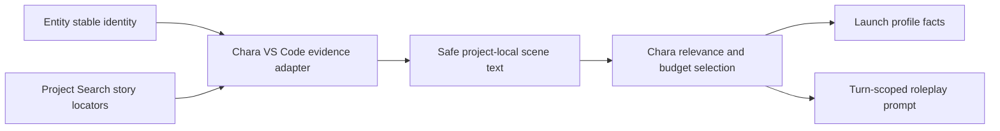

## Context

The current Character Dialogue path has two independent evidence projections:

- launch-time profile assembly calls `createCharacterProfileEvidenceReader()`, whose relationship,
  occurrence, representation-hint, and script-context methods all return empty arrays;
- turn-time evidence calls Project Search with one string containing the user's question, internal
  Entity ID, display name, canonical name, and aliases.

Project Search intentionally applies all normalized query tokens as an AND filter. Its
`story-symbols` partition indexes role and scene locators, not arbitrary dialogue and action text.
Consequently, a query such as `今天去哪里了？ char_小橘 小橘` rejects every scene even when the
Fountain script contains the answer and the selected Entity is valid.

The accepted package boundaries require Entity to own stable generic identity, Search to own project
locator discovery, and Chara to own Character evidence selection and prompt composition. The deleted
Dashboard evidence path cannot be restored as a compatibility fallback.

## Goals / Non-Goals

**Goals:**

- Restore launch-time profile occurrences and script context through public Entity, Search, and
  Content boundaries.
- Discover story locators with Character identity terms only, using OR semantics across canonical
  name, display name, and aliases.
- Materialize project-local scene text inside the Chara VS Code Host and rank it against the current
  turn inside Chara core.
- Make missing identity, unavailable Project Search, and unreadable required dependencies visible to
  the role-session caller before the model response starts.
- Prove the canonical path with tests that poison the retired empty reader and assert exact evidence
  reaches the responder prompt.

**Non-Goals:**

- Restoring Dashboard DTOs, files, commands, or runtime ownership.
- Moving Character prompt, profile, session, or evidence ownership into Entity or Search.
- Adding full-text or semantic document storage to the `story-symbols` adapter.
- Persisting derived profile facts back into `characters.json`.
- Adding Character tools, a second Agent loop, or a Webview-specific evidence protocol.

## Decisions

### 1. Character identity and scene discovery are separate from turn relevance

Chara will resolve the stable `CreativeEntity` first, derive non-empty canonical name, display name,
and aliases, and issue bounded Project Search requests per identity term. Results are deduplicated by
stable Project Search item ID.

The user's natural-language question and internal Entity ID will not be sent to `story-symbols`.
Those values are not story-symbol identities and are incompatible with Search's all-token matching
contract.

Alternative considered: change Project Search to OR-match every token. Rejected because it would
weaken search behavior for every consumer and still mix internal identity with user intent.

### 2. Search returns locators; Chara reads and ranks scene text

The existing Project Search command remains the locator boundary. Chara converts eligible
`story-scene`, `story-section`, and `script-role` items into safe project-local locators, reads text
through the existing VS Code file adapter, and uses the host-neutral Character evidence strategy for
dedupe, relevance, freshness, and budget selection.

Chinese turn relevance will use bounded CJK substring tokens in addition to current normalized terms
so questions such as `今天去哪里了？` can rank scenes containing `今天在学校` without introducing a
general semantic index.

Alternative considered: index complete Fountain dialogue/action bodies in Search. Rejected for this
repair because Search would gain a larger content-indexing responsibility and migration surface when
Chara already owns safe text materialization and bounded prompt evidence.

### 3. Launch profile and turn evidence share one canonical Host adapter

A package-owned VS Code Character project evidence adapter will compose:

- public Entity identity reads;
- public Project Search command execution;
- existing Character evidence locator conversion and safe text materialization.

The profile assembler will receive real occurrence and script-context facts from this adapter.
Character Dialogue and Embody turn loaders will use the same identity-scoped search behavior. The
current empty profile reader will be deleted rather than retained as a fallback.

### 4. Dependency failures stop the turn; legitimate absence remains explicit evidence

An Entity identity mismatch, unavailable Project Search command, or failed required evidence read
will reject the evidence operation and be projected by the controller as a visible role-session
error. The model responder will not run for that turn.

A successful search with no Character scene locators is a legitimate project state. It produces an
empty evidence bundle whose prompt explicitly says no project evidence was loaded; it does not fall
back to Dashboard, broad workspace search, the Agent model's memory, or unscoped files.

Alternative considered: retain the current warning-and-continue behavior. Rejected because it turns
an internal dependency failure into an apparently successful but factually degraded roleplay turn.

### 5. Evaluation disposition

The change uses `create` for a target-scoped Character project-evidence Evaluation because no current
suite owns the role-session evidence behavior. Real TUI execution remains blocked until the canonical
TUI supports Character role-session input and exposes bounded evidence facts. Deterministic tests and
Extension Development Host validation are required now and must not be described as real TUI Agent
Evaluation acceptance.

## Risks / Trade-offs

- [Large scripts produce many Character scenes] -> Bound identity queries, dedupe stable item IDs,
  cap locators, and apply existing chunk/token budgets before prompt construction.
- [Aliases cause repeated Project Search calls] -> Deduplicate normalized identity terms and results;
  keep calls bounded by the Entity record rather than arbitrary user input.
- [CJK substring scoring over-ranks common terms] -> Use bounded bigrams only for CJK sequences and
  retain authority, freshness, Entity-name, transcript, and stable source-order signals.
- [A provider returns malformed or out-of-project locators] -> Keep existing path containment,
  extension allowlist, and omission diagnostics; never read outside the selected project.
- [Search is temporarily unavailable during activation] -> Surface a retryable role-session error and
  do not invoke the model with missing evidence.

## Migration Plan

1. Add failing core and Host regression tests for identity-only locator discovery, profile evidence,
   CJK relevance, and dependency failure.
2. Replace the empty reader with the canonical adapter and migrate both Character controllers.
3. Remove the composite natural-language/internal-ID Search query and poison the retired path in
   tests.
4. Run package tests, typechecks, repository gates, key-free Agent Evaluation, and Extension
   Development Host validation against a synthetic project.

No project data migration is required. Rollback is code-only, but restoring the empty reader or
Dashboard fallback is not an allowed rollback path.

## Open Questions

None for this repair. Full semantic Character memory and persistent CharacterVersion knowledge remain
separate future changes.
