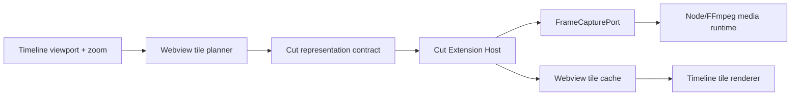

# Design: Cut density-layered virtual thumbnail tiles

## Five-layer analysis

### 1. Responsibilities

- The Webview owns viewport geometry and plans visible thumbnail tiles.
- The Cut domain owns the bounded request/result schema and tile identity
  semantics.
- The Extension Host resolves Clip source time and invokes `FrameCapturePort`.
- The Node/FFmpeg adapter remains the only frame-capture implementation.
- OTIO owns Clip timing; thumbnail tiles are disposable presentation state.

### 2. Dependencies

The Webview does not receive local paths and the Extension does not own viewport
state.

### 3. Interfaces

A thumbnail request identifies:

- `clipId`
- discrete `density` layer in pixels per timeline second
- integer `tileIndex` within that layer

The domain contract defines one fixed tile width and height for every request.
The planner derives a layer from zoom using stable power-of-two buckets. A
layer's tile duration is `tileWidth / density`; the integer tile index therefore
forms a stable timeline-space identity while scrolling inside the same layer.
For each tile the Host intersects the tile interval with the Clip interval,
samples the intersection midpoint, and maps timeline time to source time using
the Clip source start and playback rate.

A result repeats the tile identity and includes the sampled source time plus the
image data URL. Unavailable/partial failures are tile-scoped so one damaged
frame does not invalidate neighboring tiles.

Waveforms retain their existing Clip-wide request/result schema.

### 4. Extension and lifecycle

- A viewport request contains visible tiles plus half a viewport of overscan on
  each horizontal side, bounded by a maximum tile count per message.
- Scrolling within a density layer reuses intersecting cached tile identities
  and requests only missing tiles.
- Crossing a density boundary creates a new layer. The old layer may remain in
  the bounded in-memory cache for fast zoom reversal but is never rendered as
  the current layer.
- A newer batch aborts the previous Host generation. Results with a stale
  document session, revision, request generation, or density layer are
  discarded.
- Structural revisions retain only tiles whose Clip timing/source mapping and
  tile identity remain valid; otherwise they are dropped.

### 5. Testing

- Pure planner tests cover long Clips, viewport intersection, overscan, tile
  bounds, and density changes.
- Contract tests reject the removed `sampleCount` thumbnail schema and validate
  bounded tile requests.
- Host tests prove tile-to-source-time mapping, partial frame failure, abort, and
  Node media-port invocation.
- Webview tests prove fixed-position rendering and cache identity.
- Extension Development Host validation opens a long Clip in
  `~/Git/neko-test`, scrolls and zooms the timeline, and verifies incremental
  tile loading without Engine traffic.

## Canonical flow

1. Timeline layout reports scroll range and `pixelsPerSecond`.
2. The planner selects one density bucket and computes intersecting tile indices
   for visible Video Clips plus bounded overscan.
3. The Webview filters tile keys already present in its bounded cache and sends
   the current missing set. A newer viewport batch supersedes unfinished Host
   work.
4. The Host validates the bounded batch, resolves each Clip, maps tile midpoint
   to source time, and calls `FrameCapturePort.captureFrame`.
5. The Webview stores results by revision and tile identity.
6. The renderer positions each tile at its timeline offset and clips it to the
   Clip bounds.

No Clip-wide thumbnail request, flex-stretched strip, or Engine fallback remains.

## Key decisions

- Timeline-space tile indices make scrolling stable and allow adjacent Clips to
  preserve independent source mappings.
- Discrete density layers prevent every zoom pixel from invalidating the cache.
- Tile planning remains Webview-owned because only the Webview knows the actual
  viewport; file access and frame generation remain Host-owned.
- This change virtualizes derived thumbnail work, not the complete timeline DOM.
