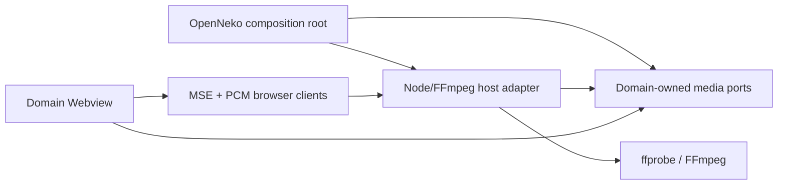

# Design: fail-closed Engine retirement and shared Node media runtime

> 2026-08-01 supersession: Extension Host, VS Code, MSE and loopback transport statements below
> record the retired migration target. The current Desktop composition uses package-owned native
> consumers, `@neko/media` Node/browser primitives, and the single `openneko:` exact-resource path.
> Historical text MUST NOT authorize a loopback, MSE or retired-host fallback.

## Five-layer analysis

### 1. Responsibilities

- Domain packages own use-case ports and presentation/application semantics.
- A neutral media package owns transport-neutral probe and prepared-media
  contracts, Node FFmpeg process/session infrastructure, and browser MSE/PCM
  consumers.
- The Extension Host owns trusted path resolution, FFmpeg/ffprobe discovery,
  processes, cancellation, temporary artifacts, cache/session lifecycle, and
  loopback HTTP.
- Webviews own `<video>`, MSE, Web Audio, rendering state, and clock projection.
- OpenNeko domain controllers own timeline/playback synchronization; FFmpeg does
  not own OTIO or project facts.

### 2. Dependencies

`neko-engine`, Engine HTTP/WebSocket clients, and Engine protobuf DTOs are not
nodes in the target graph. Webviews never receive local filesystem paths or
Node/VS Code objects.

### 3. Interfaces

The shared surface is deliberately infrastructural:

- source identity and authorized host path inputs
- structured media probe results
- cancellable FFmpeg command execution
- frame/thumbnail and waveform extraction
- explicit preview preparation descriptors
- versioned framed float32 PCM descriptors
- explicit audio/subtitle extraction jobs
- staged media export/transcode jobs
- session disposal and diagnostics

`@neko/media` owns those contracts and exposes separate `node` and `browser`
entry points. The Node entry owns FFmpeg process execution and opaque loopback
Range/PCM sessions. The browser entry owns MSE and framed PCM consumption.
Feature packages may define narrower domain adapters on top, but may not import
another feature package's private media implementation.

Preview, Canvas, Tools, Agent, Assets, and Cut each define narrower ports from
those primitives. The shared package does not expose a broad `EngineClient`
facade or product commands.

All session-scoped operations carry explicit session identity. Unknown, stale,
or mismatched identity fails visibly.

### 4. Extension points

- Executable discovery, codec preparation policy, and temporary storage are
  injected host strategies with one selected implementation.
- Codec support is data-driven by ffprobe results and an explicit preparation
  profile, not inferred from filename extensions.
- Browser direct-play profiles are qualified against the actual VS Code
  Electron runtime. Unqualified sources use explicit remux/transcode.
- Domain ports remain the only product-level replacement seams.

### 5. Testing

- Source and manifest gates reject Engine imports, IDs, commands, routes,
  dependencies, DTOs, and fallback mocks in product code.
- Composition tests assert that `neko-engine` is absent before replacements are
  connected.
- Contract tests cover probe projection, command construction, cancellation,
  Range/session isolation, PCM framing, cache publication, and cleanup.
- Consumer path tests assert the new domain adapter/handler and poison legacy
  calls.
- Extension Development Host tests validate MSE video, PCM audio, seek/sync,
  frame/thumbnail/waveform operations, and explicit transcode.
- Runtime tests open only `${HOME}/Git/neko-test`. Generated data is confined
  to its marker-owned `.neko/.functional/media-runtime` subtree; tests must not
  open a repository-local or other workspace, delete the workspace root, or
  modify user-provided media.
- Full build/test/check and legacy/unused gates run before physical package
  deletion is accepted.

## Removal-first sequence

1. Remove Engine from the product feature and packaging composition.
2. Remove extension dependencies and public capability/command discovery.
3. Install an Engine-retirement quality gate.
4. Delete or poison product Engine clients/providers/handlers so accidental
   calls fail deterministically.
5. Freeze shared media contracts.
6. Extract and connect the Node/FFmpeg and browser adapters.
7. Remove now-unused Engine protocol/client/native code.
8. Delete `packages/neko-engine` after repository closure is empty.

Steps 1–4 intentionally expose missing media adapters. They must not be made
green with optional providers, no-op results, empty metadata, or Engine mocks.

## Consumer ownership

| Consumer | Domain-owned responsibility | New adapter responsibility |
| --- | --- | --- |
| Preview | panel session, selected asset, presentation | probe, prepare video, PCM, capture |
| Canvas | node media lifecycle and canvas clock | prepare video, PCM, frame capture |
| Tools | diff/silence/visual diagnostics | FFmpeg decode/analyze inputs and results |
| Agent | preprocessing intent and artifact ownership | keyframes, frames, audio, transcode |
| Assets | entity metadata and thumbnail association | probe and thumbnail extraction |
| Cut | OTIO timeline, preview clock, export intent | prepare, PCM, waveform, export |

No domain package imports another feature package's private adapter.

## Media policy

- Qualified H.264 and VP8 sources may use direct Webview playback; container
  incompatibility uses explicit remux.
- Other codecs use explicit H.264 SDR proxy/transcode for initial preview.
- Audible media is decoded to framed float32 PCM; the media `<video>` is muted
  where OpenNeko owns synchronization.
- Each preview preparation is capped to a short canonical time window even when
  the active OTIO Clip or next input boundary is much longer. The existing
  prepare-next/activate boundary transition continues playback on demand.
- 10-bit/HDR sources remain valid. A profile must declare whether it preserves
  HDR or tone-maps to SDR; the UI must not claim native HDR fidelity without
  runtime qualification.
- Probe, frame, thumbnail, waveform, audio extraction, subtitle extraction, and
  export operate through FFmpeg jobs and do not require full-file reads into
  JavaScript memory.

## Error and lifecycle contract

- Missing FFmpeg/ffprobe: initialization diagnostic, no fallback.
- Missing filter/encoder required by a selected proxy profile: runtime
  capability diagnostic before preparation, not a media-corruption diagnostic.
- Media failures use explicit scope:
  - source-level unusable: the container or all selected media cannot be read;
  - stream-level unavailable: a selected stream cannot produce usable output;
  - interval-local corruption: damaged packets/frames affect only bounded
    timestamps or intervals;
  - derived-operation partial: successful thumbnails or waveform intervals are
    retained while failed samples carry corruption evidence.
- Unsupported or invalid media diagnostics include detected stream/container
  context and never promote a localized failure to whole-source unavailability.
- Abort/dispose: terminate owned processes, responses, audio nodes, sessions,
  and temporary artifacts.
- Unknown message/schema/session: fail-visible diagnostic.
- Derived artifacts publish only validated successful samples. Partial results
  are explicit and cannot masquerade as complete success.
- Audible preview activation waits until every authoritative PCM client has
  scheduled its first packet. A discontinuity releases Webview clients and host
  sessions as one stop transition.

## Deletion gate

Physical removal is allowed only when all of these are zero:

- product feature, manifest, command, configuration, and capability references
- production imports and package dependencies
- Engine HTTP/WebSocket routes and clients
- generated Engine DTO consumers
- native module loading and platform artifact staging
- build, release, CI, test, fixture, and documentation ownership

Historical ADR text may retain clearly marked historical references; current
architecture and executable paths may not.

## Risks

- Removing product composition first temporarily makes unported media features
  fail; that is the intended fail-closed state.
- FFmpeg distribution and codec licensing remain release concerns.
- Tools media diff may require bounded intermediate decode data; it must avoid
  loading unbounded media into memory.
- Browser codec/HDR support varies by Electron build and hardware; qualification
  must use the actual Extension Development Host.
